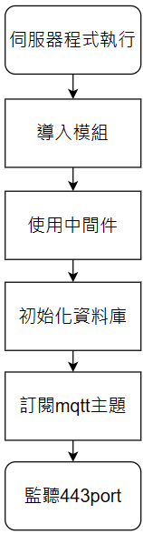
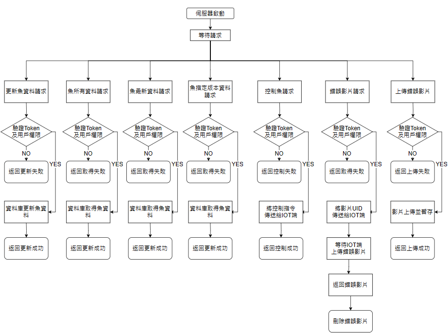
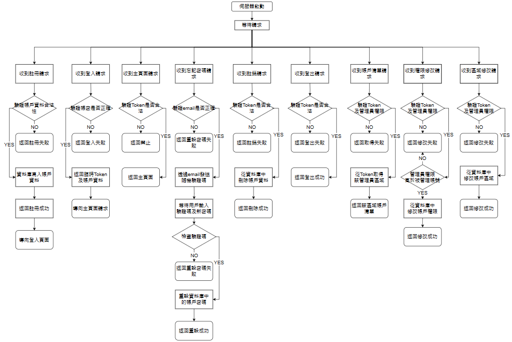

# AIFI_WEB
## introduce
* 專案名稱: 智慧魚監控系統之網頁後端
* 專案架構: 
    * 運行環境: Node.js
    * API框架: Express.js 
    * 資料庫: MySQL
* 專案目標: 
    * 智慧魚與客戶之間的通訊
    * 遠端更新及控制智慧魚
    * 保證傳輸安全性
    * 保證資料庫安全性

## build method
1. 安裝Node.js 16.17.1版本

    *  windows環境: [官網下載](https://nodejs.org/)
    *  linux環境:
    
        ```
        sudo apt update
        sudo apt install nodejs npm
        sudo npm install -g n
        sudo n 16.17.1
        ```

2. 建置MySQL資料庫

    *  windows環境: [官網下載](https://www.mysql.com/)
    *  linux環境:
    
        Bash
        ```
        sudo apt install mysql-server
        sudo mysql -u root -p
        ```
        MySQL
        ```
        CREATE USER 'username'@'localhost' IDENTIFIED BY 'password';
        /* 需自行替換 'username' 及 'password' */

        GRANT ALL PRIVILEGES ON *.* TO 'username'@'localhost';
        /* 需自行替換 'username' */

        FLUSH PRIVILEGES;

        CREATE DATABASE database_name;
        /* 需自行替換 database_name */

        EXIT;
        ```
       
3. 建置MQTT伺服器

    *  windows環境: [官網下載](https://mosquitto.org/download/)
    *  linux環境:
    
        ```
        sudo apt install mosquitto
        sudo systemctl start mosquitto
        sudo systemctl enable mosquitto.service
        mosquitto -v
        systemctl status mosquitto
        sudo vim /etc/mosquitto/mosquitto.conf
        ```
        此時會開啟mosquitto的配置檔，在最底部加上
        ```
        listener 1883
        ```
        按 : 鍵，然後按 w q Enter 退出vim編輯器
        ```
        sudo systemctl restart mosquitto
        sudo mosquitto_passwd -c /etc/mosquitto/passwd <username>
        #<username>改成你要的使用者帳戶名
        sudo vim /etc/mosquitto/mosquitto.conf
        #開啟vim後在最頂端加入
        per_listener_settings true
        #在最底端加入
        allow_anonymous false
        password_file /etc/mosquitto/passwd
        #退出vim
        sudo systemctl restart mosquitto
        systemctl status mosquitto
        ```

4. 安裝項目依賴的模組
    ```
    npm install
    ```

5. 配置環境變數

    * 在專案中新增.env文件
    * 配置下列環境變數
        ```
        DB_SQL_HOST = 'localhost'
        DB_SQL_USER =  ''
        DB_SQL_PASSWORD = ''  
        DB_SQL_PORT = 3306
        DB_SQL_DATABASE = 'sys'
        DB_MQTT_IP = 'mqtt://localhost:1884'
        DB_MQTT_USER = ''
        DB_MQTT_PASSWORD = ''
        DB_LINE_TOKEN = ''
        DB_GMAIL_ACCOUNT = ''
        DB_GMAIL_PASS = ''
        DB_JWTKEY = ''
        DOMAIN = 'localhost:3000'
        ```

6. 建置資料庫模型

    *  windows環境:
        ```
        npm install @prisma/cli --save-dev
        npx prisma migrate dev
        npx prisma generate
        ```
    *  linux環境:
        ```
        sudo npm install @prisma/cli --save-dev
        sudo npx prisma migrate dev
        sudo npx prisma generate
        ```

7. 配置apache代理 (windows測試環境可跳過)
    ```
    sudo apt install apache2
    sudo systemctl start apache2
    sudo systemctl enable apache2
    sudo a2enmod proxy
    sudo a2enmod proxy_http
    sudo systemctl status apache2
    sudo systemctl restart apache2
    cd /etc/apache2/sites-available
    sudo vim 000-default.conf
    ```
    配置文件中，新增以下兩行
    ```
    ProxyPass / http://localhost:3000/
    ProxyPassReverse / http://localhost:3000/
    ```

8. 安裝PM2
    *  windows環境: 
        ```
        npm install -g pm2
        ```
    *  linux環境:
        ```
        sudo npm install -g pm2
        ```

9. 啟動伺服器
    *  windows環境: 
        ```
        pm2 start app.js
        ```
    *  linux環境:
        ```
        sudo pm2 start app.js
        ```
## API document

API文件: [API.pdf](readme/API.pdf)

API測試文件: [APItest.http](httptest/APItest.http)

## flow chart
### 伺服器啟動

### 伺服器響應
#### mqtt

#### Restful-fish

#### Restful-user

## Folder structure
- [nindex.js](nindex.js) .................................................................................主程式
- [package.json](package.json) ..........................................................................官方模組包
- [package-lock.json](package-lock.json)
- config
  - [fishError.json](config/fishError.json) .............................................................魚錯誤資訊解碼表
  - [subTopics.js](config/subTopics.js) ................................................................mqtt訂閱主題模板
- modules
  - inital
    - [index.js](modules/inital/index.js) ...........................................................初始化函數
    - [task.js](modules/inital/task.js) ..............................................................初始化額外任務
  - middleware
    - [verifyAdmin.js](modules/middleware/verifyAdmin.js) ...............................................管理員檢查
    - [verifyDomin.js](modules/middleware/verifyDomin.js) ...............................................網域名檢查
    - [verifyToken.js](modules/middleware/verifyToken.js) ................................................使用者驗證
  - mqtt
    - [index.js](modules/mqtt/index.js) ............................................................mqtt連線初始化
    - proc
        - [connect.js](modules/mqtt/proc/connect.js) ...........................................連線執行函數
        - [message.js](modules/mqtt/proc/message.js) .........................................訊息處理函數
  - util
    - [expressCompose.js](modules/util/expressCompose.js) ......................................函數組合模組
    - [infoMap.js](modules/util/infoMap.js) ......................................................資料映射模組
    - [jsonFile.js](modules/util/jsonFile.js) .......................................................json解釋模組
    - [lineNotify.js](modules/util/lineNotify.js) ...................................................line訊息模組
    - [mqtt.js](modules/util/mqtt.js) ............................................................指定broker
    - [myPrisma.js](modules/util/myPrisma.js) ...................................................資料庫客戶端
    - [newSQL.js](modules/util/newSQL.js) ......................................................資料庫處理模組（已棄用）
    - [nodeMailer.js](modules/util/nodeMailer.js) ................................................電子郵件模組
    - [section.js](modules/util/section.js) ........................................................區域處理模組
- prisma
  - migrations
    - 20230825164815_initial
        - [migration.sql](prisma/migrations/migration.sql) ...................................................資料庫處理模組
    - 20231212024614_conteoller_name
        - [migration.sql](prisma/migrations/migration.sql) ...................................................資料庫處理模組
  - [schema.prisma](prisma/schema.prisma) ........................................................資料庫模型
- routes
    - [index.js](routes/api/index.js) ....................................................................路由模組
  - api
    - [index.js](routes/api/index.js) ........................................................api模組
    - account
      - [index.js](routes/api/account/index.js) ........................................................帳戶模組
      - proc
        - [deleteUser.js](routes/api/account/proc/deleteUser.js) ........................................................註銷處理
        - [info.js](routes/api/account/proc/info.js) ........................................................取得帳戶資料處理
        - [list.js](routes/api/account/proc/list.js) ........................................................取得用戶資料清單處理
        - [login.js](routes/api/account/proc/login.js) ........................................................登入驗證處理
        - [logout.js](routes/api/account/proc/logout.js) ........................................................登出處理
        - [removeUser.js](routes/api/account/proc/removeUser.js) .......................................................由除用戶處理
        - [resetPasswordCheck.js](routes/api/account/proc/resetPasswordCheck.js) ........................................................重設密碼驗證處理
        - [resetPassword.js](routes/api/account/proc/resetPassword.js) ........................................................重射密碼處理
        - [reviseLevel.js](routes/api/account/proc/reviseLevel.js) ........................................................更改帳戶權限處理
        - [reviseSection.js](routes/api/account/proc/reviseSection.js) ........................................................更改帳戶區域處理
        - [signUp.js](routes/api/account/proc/signUp.js) ........................................................帳戶註冊處理
        - [sticker.js](routes/api/account/proc/sticker.js) ........................................................帳戶頭貼處理
        - [verify.js](routes/api/account/proc/verify.js) ........................................................帳戶郵箱驗證
    - controller
        - [index.js](routes/api/controller/index.js) ........................................................遙控器模組
        - proc
            - [addController.js](routes/api/controller/proc/addController.js) ........................................................新增遙控器處理
            - [deleteController.js](routes/api/controller/proc/deleteController.js) ........................................................刪除遙控器處理
            - [getController.js](routes/api/controller/proc/getController.js) ........................................................取得遙控器資料
            - [reviseAble.js](routes/api/controller/proc/reviseAble.js) ........................................................更改遙控器設定
    - fish
        - [index.js](routes/api/fish/index.js) ........................................................機器魚模組
        - proc
            - [addFishData.js](routes/api/fish/proc/addFishData.js) ........................................................新增機器魚資料
            - [addFish.js](routes/api/fish/proc/addFish.js) ........................................................新增機器魚處理
            - [changePhoto.js](routes/api/fish/proc/changePhoto.js) ........................................................機器魚預設圖片更改
            - [fishAssign.js](routes/api/fish/proc/fishAssign.js) ........................................................分配機器魚控管權
            - [fishControl.js](routes/api/fish/proc/fishControl.js) ........................................................機器魚控制處理
            - [fishDelete.js](routes/api/fish/proc/fishDelete.js) ........................................................刪除機器魚處理
            - [fishDisassign.js](routes/api/fish/proc/fishDisassign.js) ........................................................移除機器魚控管權
            - [fishExplore.js](routes/api/fish/proc/fishExplore.js) ........................................................探查機器魚處理
            - [fishPhoto.js](routes/api/fish/proc/fishPhoto.js) ........................................................機器魚圖片處理
            - [getFIshData.js](routes/api/fish/proc/getFIshData.js) ........................................................取得機器魚最新資料
            - [getFishTable.js](routes/api/fish/proc/getFishTable.js) ........................................................機器魚所有資料
            - [getHistoryData.js](routes/api/fish/proc/getHistoryData.js) ........................................................機器魚歷史資料查詢
            - [relocalFish.js](routes/api/fish/proc/relocalFish.js) ........................................................調度機器魚處理
            - [reviseTime.js](routes/api/fish/proc/reviseTime.js) ........................................................游動時數處理
    - ota
        - [index.js](routes/api/ota/index.js) ........................................................OTA模組
        - proc
            - [bin.js](routes/api/ota/proc/bin.js) ........................................................燒錄檔處理
            - [burn.js](routes/api/ota/proc/burn.js) ........................................................燒錄執行處理
            - sh 
    - section
        - [index.js](routes//api/section/index.js)  ........................................................區域模組
        - proc
            - [addDepart.js](routes//api/section/proc/addDepart.js) ........................................................新增部門處理
            - [addInstruction.js](routes//api/section/proc/addInstruction.js) ........................................................新增機構處理
            - [addPool.js](routes//api/section/proc/addPool.js) ........................................................新增水池處理
            - [deleteDapart.js](droutes//api/section/proc/eleteDapart.js) ........................................................刪除部門處理
            - [deleteInstruction.js](routes//api/section/proc/deleteInstruction.js) ........................................................新增機構處理
            - [deletePool.js](routes//api/section/proc/deletePool.js) ........................................................刪除水池處理
            - [getSection.js](routes//api/section/proc/getSection.js) ........................................................取得區域資料
  - page
    - [index.js](routes/page/index.js)  ................................................................頁面控管
    - [sendPage.js](routes/page/sendPage.js) ........................................................傳送頁面處理
    
- test
    - [APItest.http](test/httptest/APItest.http) .........................................................................API測試文件
    - [db.js](db.js) .......................................................................................資料庫測試腳本
    - [test.js](test/test.js)......................................................................................開發測試用
## Link
[後端簡報](https://www.canva.com/design/DAF9T5eazdM/07bxDsgYrGoUraGYSz6TvQ/view?utm_content=DAF9T5eazdM&utm_campaign=designshare&utm_medium=link&utm_source=editor)

[資料庫](https://www.canva.com/design/DAGEz7w77G8/e3o321-qg1c5ZLpjAGGvng/view?utm_content=DAGEz7w77G8&utm_campaign=designshare&utm_medium=link&utm_source=editor)

[網站資料串接](https://www.canva.com/design/DAGFB2eXKQ4/yhRx7Xsy8OjJTbIEgHq8Vw/view?utm_content=DAGFB2eXKQ4&utm_campaign=designshare&utm_medium=link&utm_source=editor)

## develop diary
* README版本: 2
* 未開發功能:
    * 智慧魚OTA
    * 其他智慧生物監控
* 更新日期: 2023/9/8
## developers
* 專案經理: Jason 
* 合作開發者: Jack,James
* 開發者: John